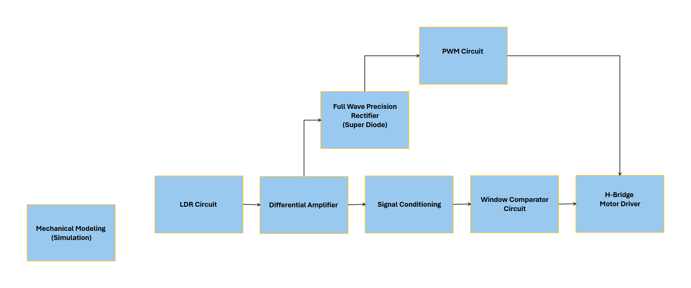
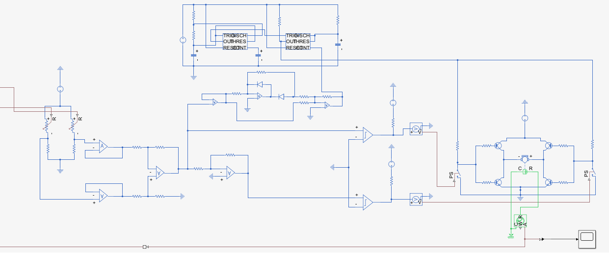
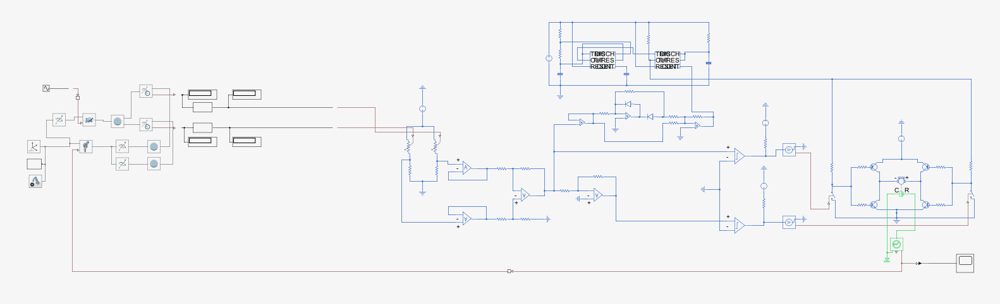
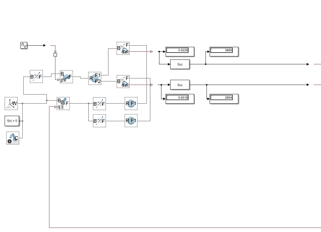
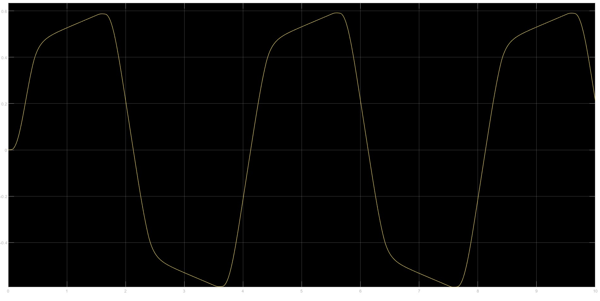

# Single-Axis Solar Tracker

This project implements a **single-axis solar tracking system** to maximize solar energy collection by continuously aligning a photovoltaic (PV) panel with the direction of sunlight. By minimizing the angle of incidence and reducing the cosine error, the system improves the panel's efficiency and overall energy yield.

Developed as a part of the **CSE 271s - System Dynamics & Control Components** course (Fall 2024), this project addresses real-world challenges, particularly in regions with limited access to energy, by offering a cost-effective and autonomous solar energy solution.

## Table of Contents

1. [Features](#features)  
2. [Installation](#installation)  
3. [Usage](#usage)  
4. [Simulation](#simulation)  
5. [Hardware Design](#hardware-design)  
6. [Mechanical Modeling](#mechanical-modeling)  
7. [Testing and Results](#testing-and-results)   
8. [Troubleshooting](#troubleshooting)  
9. [License](#license)

## Features

- 🌞 Light intensity sensing using LDR-based voltage divider
- ⚙️ Real-time motor control via differential amplifier and PWM
- 🔁 Precision tracking using H-bridge DC motor driver (L298)
- 🔄 Support for both constant and variable speed modes
- 🔋 Power-efficient operation using lithium battery setup
- 🛠️ MATLAB Simulink-based simulation and mechanical modeling

  ## Installation

### Prerequisites

- MATLAB R2023b or later with Simulink
- Simscape Multibody (for mechanical modeling)
- Basic electronics hardware and breadboarding tools

### Files

- `Solar Tracker.pdf`: Detailed project documentation
- `fullCircuit.slx`: Complete Simulink model of the control and mechanical system
- `V.mat`: Input data for simulation (e.g., light source motion)

## Usage

### Simulink Simulation

1. Open `fullCircuit.slx` in MATLAB.
2. Load input data:

   ```matlab
   load('V.mat')
   ```

3. Run the simulation to visualize solar panel tracking based on LDR inputs.

### Hardware Implementation

- Assemble the circuit on a breadboard using the provided schematics.
- Use a light source to simulate the sun and observe the motor-driven panel alignment.

## Simulation

### Variable Speed Control

- PWM signal varies with LDR voltage difference.
- 555 timer adjusts duty cycle based on light intensity imbalance.
- Simulink simulates realistic conditions including wind resistance and panel inertia.

### Constant Speed Control

- Fixed 5V control input to 555 timer for stable PWM output.
- Useful for testing the system's mechanical consistency under constant conditions.

## Hardware Design

- **LDR Voltage Divider**: Senses differential light intensity.
- **Differential Amplifier**: Amplifies LDR voltage difference (gain = 1).
- **Super Diode (Precision Rectifier)**: Converts bipolar signal to unipolar for PWM control.
- **PWM Circuit**: 555 timer generates a variable duty signal.
- **H-Bridge (L298)**: Controls motor direction and speed.
- **Power Supply**: ±7V for op-amps, 5V regulated for logic and motor control.

## Mechanical Modeling

- Simulates LDRs as small masses mounted on a joint.
- A moving "light source" affects simulated resistance values via a sigmoid function.
- Motor response drives joint rotation based on light displacement.

## Testing and Results

### 📷 Block and Circuit Diagrams

- Block Diagram


- Electrical Circuit


- Full Circuit


### ⚙️ Mechanical Modeling

- Mechanical Modeling


- 🎥 [Mechanical Demo Video](./Pics_and_Video/Mechanical_Modeling.mp4)

### 📈 Motor



### 📊 Observations

- The system successfully tracked the light source as it moved.
- The PWM duty cycle responded dynamically to LDR voltage differences.
- The motor rotated smoothly under both variable and constant speed configurations.
- No significant overshoot or oscillation was observed in mechanical simulations.
  
- Oscilloscope data confirms smooth voltage transitions across:
  - LDR divider output
  - Differential amplifier
  - Comparator with hysteresis
  - Super diode
  - PWM signal (144 Hz)

- Motor speed directly correlates to PWM duty cycle, confirming system responsiveness and stability.

## Troubleshooting

| Problem                             | Solution                                                      |
|------------------------------------|---------------------------------------------------------------|
| Comparator not handling -ve input  | Used signal inversion and proper voltage references           |
| Unequal resistor behavior          | Adjusted reference voltage for consistent comparator response |
| No -ve supply for OP-AMP           | Created ±7V with two lithium batteries in series              |

## License

This project is provided for academic and educational purposes only. If reused or modified, please credit the original authors.
